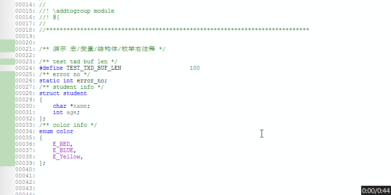

# si3_comment
source in sight comment base on doxygen

## 2018年5月7日11:27:00

加入参考 注释,准备按照标准文档[doxygen](http://www.doxygen.nl/)进行注释

一些参考网页

- 1.[烤鸭的Source Insight学习笔记](https://blog.csdn.net/benkaoya/article/details/8296197)

- 2.source in sight 自带帮助文档 Macro Language Guide

## 2018年5月9日15:28:48

文档编写 **doxygen.em** 主要功能分为下面几种

| 宏名 | 功能 | 备注 |
|---|---|---|
| AddVarUp| 添加宏/变量/结构体/枚举上注释 | ```/** */``` |
| AddVarRight|添加宏/变量/结构体/枚举右注释|```/**< */``` |
| AddFuncHeader| 添加函数头注释| ```/** @brief ``` |
| AddFuncHeaderAutoGenerate| 根据定义好的函数名称直接生成doxygen 注释| ```/** @brief ``` |
| AddStruct| 添加结构体，按照步骤生成| N/A|
| AddStructDemo| 添加结构体演示| N/A|
| AddEnum| 添加枚举，按照步骤生成| N/A|
| AddEnumDemo| 添枚举演示| N/A|
| AddFileHeader| 添加文件头| N/A|

以下演示用markdown 编辑器打开可以获得动画效果
GIF工具来自何纯提供 [ScreenToGif](http://www.screentogif.com/?l=zh_cn)

- 1.AddVarUp 演示
根据设定好的快捷键，进行注释


- 2.AddVarRight 演示
根据设定好的快捷键，进行注释



- 3.AddFuncHeader 演示
根据设定好的快捷键，进行注释


- 4.AddFuncHeaderAutoGenerate演示
根据设定好的快捷键，在需要添加函数的上方(光标处到函数部分，不允许有除了注释其它非空字符)，启动快捷键，解析函数自动生成注释，具体细节描述可以在此基础上展开，这个比较实用和好用


- 5.AddStruct演示
根据设定好的快捷键，按照步骤一步步生成结构体
	- 4.1 首先输入结构体名字
    - 4.2 输入成员名字   	 
    - 4.3 输入成员名字 注释
    - 4.4 如果输入end 则结束结构体构造，否则循环4.2到4.3过程


- 6.AddStructDemo演示
根据设定好的快捷键，生成结构体演示，可以在此基础上编写自己需要的结构体


- 7.AddEnum演示
根据设定好的快捷键，按照步骤一步步生枚举
	- 7.1 首先输入枚举名字
    - 7.2 输入成员名字   	 
    - 7.3 输入成员名字 注释
    - 7.4 如果输入end 则结束枚举构造，否则循环7.2到7.3过程 


- 8.AddEnumDemo演示
根据设定好的快捷键，生成结构体演示，可以在此基础上编写自己需要的枚举


- 9.AddFileHeader演示
根据设定好的快捷键，自动判断新建文件类型 自动生成doxygen注释，比较实用和好用
	- 9.1 首先输入作者姓名
    - 9.2 输入模块名，结束
 以下演示针对新建 C文件和 H文件 生成doexygen格式

  	

## 2018年5月10日09:47:58

- 添加宏使用说明

将 02_source 中 doxygen.em 复制

```
C:\用户目录\Documents\Source Insight\Projects\Base\doxygen.em 
```
然后打开 base 项目,进行添加 doxygen.em 文件，再同步即可
```
Progect->Open progect->Base
```
- 分配快捷键说明
选择菜单Options-> Key Assignments... 为宏添加一个快捷键


